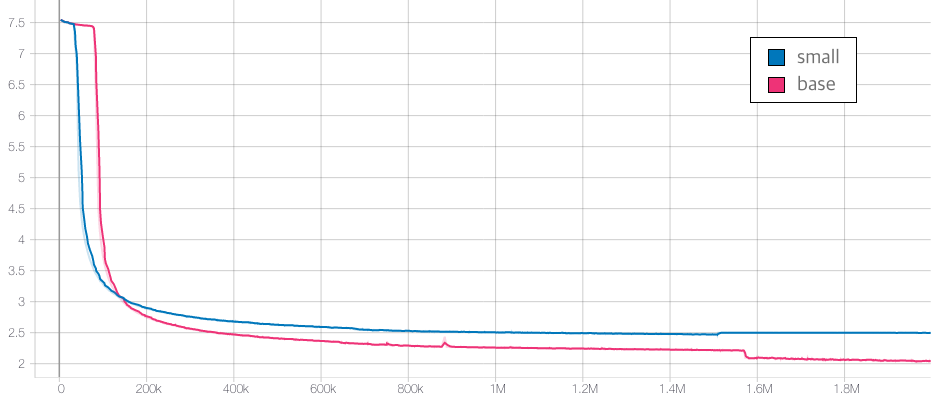
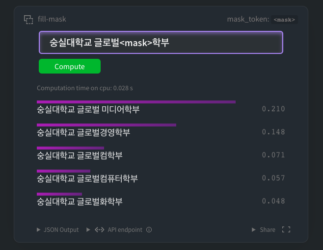
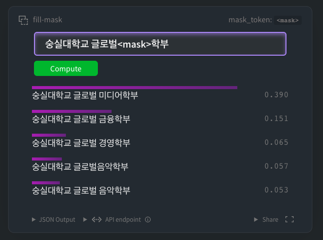
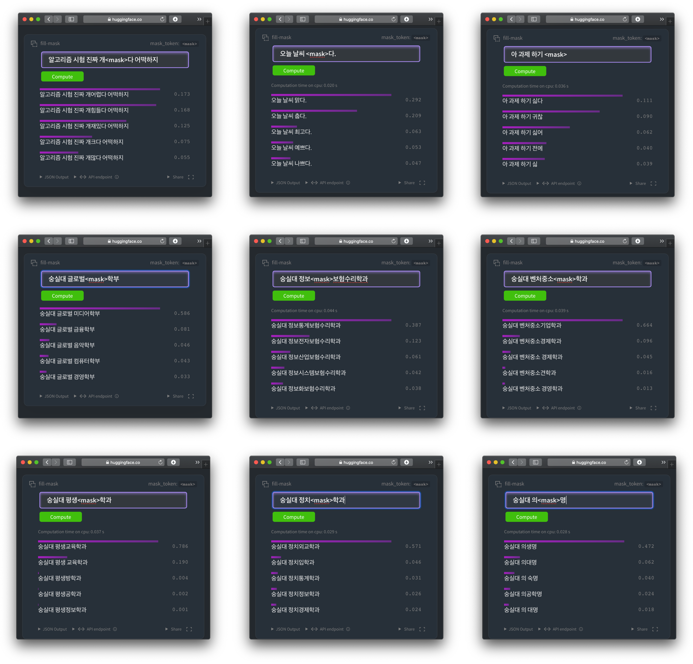
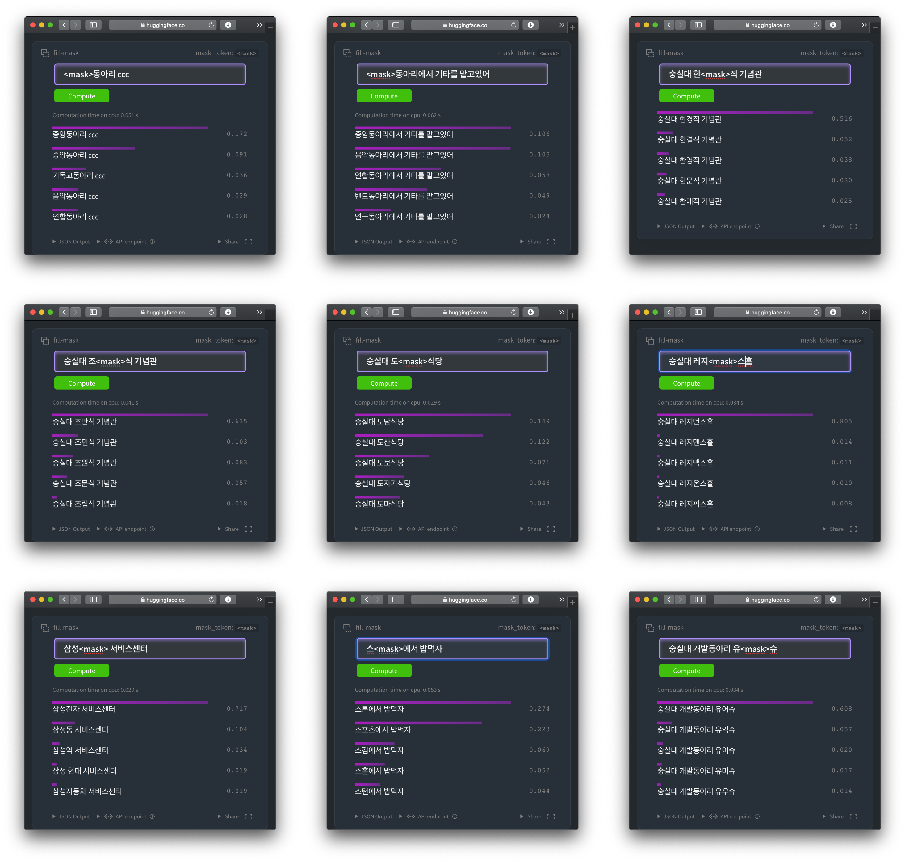
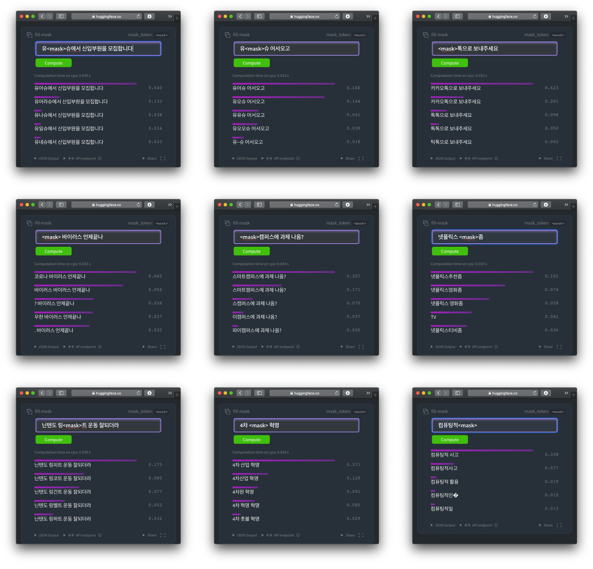

# Soongsil-BERT(KcBERT v2) : Soongsil Univ. Community BERT

### 숭실대학교 or 대학 커뮤니티 전용 언어모델

** Updates on 2020.11.06 **

Soongsil BERT 를 Google Colab에서 사전학습을 진행할 수 있는 튜토리얼을 제공합니다! 아래 버튼을 눌러보세요.(미완성)

<a href="">  
</a> : 공개 예정

토크나이징 코드 : 공개 예정

Down Stream Task 학습 예제 : 공개 예정

---

공개된 한국어 BERT는 대부분 한국어 위키, 뉴스 기사, 책 등 잘 정제된 데이터를 기반으로 학습한 언어모델입니다. 한편, 실제로 NSMC와 같은 댓글형 데이터셋은 정제되지 않았고 구어체 특징에 신조어가 많으며, 오탈자 등 공식적인 글쓰기에서 나타나지 않는 표현들이 빈번하게 등장합니다.  

Beomi 님의 [KcBERT](https://github.com/Beomi/KcBERT)는 위와 같은 특성의 데이터셋에 적용하기 위해, 네이버 뉴스의 댓글과 대댓글을 수집해 토크나이저와 BERT모델을 처음부터 학습한 Pretrained BERT 모델입니다. 

Soongsil BERT(KcBERTv2)는 대학 커뮤니티 특성에 맞는 데이터셋에 적용하기 위해, KcBERT의 데이터에 더해 대학 커뮤니티, 대학 공지사항 등의 데이터를 추가하여 처음부터 학습한 `RoBERTa모델 기반의` Pretrained BERT 모델입니다.

Soongsil BERT는 Huggingface의 Transformers 라이브러리를 통해 간편히 불러와 사용할 수 있습니다. (별도의 파일 다운로드가 필요하지 않습니다.)

## How to use

### Requirements

- `pytorch ~= 1.6.0`

- `transformers ~= 3.0.1`
- `emoji ~= 0.6.0`
- `soynlp ~= 0.0.493`

```python
from transformers import AutoTokenizer, AutoModelWithLMHead

# Small Model (220MB)

tokenizer = AutoTokenizer.from_pretrained("jason9693/soongsil-roberta-small")

model = AutoModelForMaskedLM.from_pretrained("jason9693/soongsil-roberta-small")

# Base Model (370M)

tokenizer = AutoTokenizer.from_pretrained("jason9693/soongsil-roberta-base")

model = AutoModelForMaskedLM.from_pretrained("jason9693/soongsil-roberta-base")
```

## Train Data & Preprocessing

### Raw Data

학습 데이터는 KcBERT에서 사용한 데이터에 아래 항목들을 추가하여 학습을 진행하였습니다.

1. 에브리타임 숭실대학교 게시판
2. 숭실대학교 커뮤니티 유어슈
3. 캠퍼스픽
4. 숭실대학교 dcinside
5. 숭실대학교 각 학과 공지사항
6. 국립국어원 말뭉치 (Web, 구어체)

데이터 사이즈는 텍스트만 추출시 **약 20GB이며, 2억개 이상의 문장**으로 이뤄져 있습니다.

### Preprocessing

PLM 학습을 위해서 전처리를 진행한 과정은 다음과 같습니다.

1. 한글 및 영어, 특수문자, 그리고 이모지(🥳)까지!

   정규표현식을 통해 한글, 영어, 특수문자를 포함해 Emoji까지 학습 대상에 포함했습니다.

   한편, 한글 범위를 `ㄱ-ㅎ가-힣` 으로 지정해 `ㄱ-힣` 내의 한자를 제외했습니다. 

2. 댓글 내 중복 문자열 축약

   `ㅋㅋㅋㅋㅋ`와 같이 중복된 글자를 `ㅋㅋ`와 같은 것으로 합쳤습니다.

3. Cased Model

   KcBERT는 영문에 대해서는 대소문자를 유지하는 Cased model입니다.

4. 글자 단위 10글자 이하 제거

   10글자 미만의 텍스트는 단일 단어로 이뤄진 경우가 많아 해당 부분을 제외했습니다.

5. 중복 제거

   중복적으로 쓰인 댓글을 제거하기 위해 중복 댓글을 하나로 합쳤습니다.

이를 통해 만든 최종 학습 데이터는 **15GB, 1억 4천만개 문장**입니다.

아래 명령어로 pip로 설치한 뒤, 아래 clean함수로 클리닝을 하면 Downstream task에서 보다 성능이 좋아집니다. (`<unk>` 감소)

```bash
pip install soynlp emoji
```

아래 `clean` 함수를 Text data에 사용해주세요.

```python
import re
import emoji
from soynlp.normalizer import repeat_normalize

emojis = ''.join(emoji.UNICODE_EMOJI.keys())
pattern = re.compile(f'[^ .,?!/@$%~％·∼()\x00-\x7Fㄱ-힣{emojis}]+')
url_pattern = re.compile(
    r'https?:\/\/(www\.)?[-a-zA-Z0-9@:%._\+~#=]{1,256}\.[a-zA-Z0-9()]{1,6}\b([-a-zA-Z0-9()@:%_\+.~#?&//=]*)')

def clean(x):
    x = pattern.sub(' ', x)
    x = url_pattern.sub('', x)
    x = x.strip()
    x = repeat_normalize(x, num_repeats=2)
    return x
```

### Cleaned Data (KcBERT 데이터)

원본 데이터를 위 `clean`함수로 정제한 12GB분량의 txt 파일을 아래 Kaggle Dataset에서 다운받으실 수 있습니다 :)

https://www.kaggle.com/junbumlee/kcbert-pretraining-corpus-korean-news-comments


## Tokenizer Train

Tokenizer는 Huggingface의 [Tokenizers](https://github.com/huggingface/tokenizers) 라이브러리를 통해 학습을 진행했습니다.

그 중 `ByteLevelBPETokenizer` 를 이용해 학습을 진행했고, Vocab Size는 `16000'으로 진행했습니다.

Tokenizer를 학습하는 것에는 KcBERT데이터는 `1/10`로 샘플링한 데이터로 학습을 진행했고, 그외 데이터는 모두 사용했습니다.

## BERT Model Pretrain

- Soongsil BERT Small config

```json
{
  "architectures": [
    "RobertaForMaskedLM"
  ],
  "attention_probs_dropout_prob": 0.1,
  "bos_token_id": 0,
  "eos_token_id": 2,
  "gradient_checkpointing": false,
  "hidden_act": "gelu",
  "hidden_dropout_prob": 0.1,
  "hidden_size": 768,
  "initializer_range": 0.02,
  "intermediate_size": 3072,
  "layer_norm_eps": 1e-12,
  "max_position_embeddings": 514,
  "model_type": "roberta",
  "num_attention_heads": 12,
  "num_hidden_layers": 6,
  "pad_token_id": 1,
  "total_flos": 4.897939032867707e+19,
  "type_vocab_size": 1,
  "vocab_size": 16000
}
```

- Soongsil BERT Base config

```json
{
  "architectures": [
    "RobertaForMaskedLM"
  ],
  "attention_probs_dropout_prob": 0.1,
  "bos_token_id": 0,
  "eos_token_id": 2,
  "gradient_checkpointing": false,
  "hidden_act": "gelu",
  "hidden_dropout_prob": 0.1,
  "hidden_size": 768,
  "initializer_range": 0.02,
  "intermediate_size": 3072,
  "layer_norm_eps": 1e-05,
  "max_position_embeddings": 514,
  "model_type": "roberta",
  "num_attention_heads": 12,
  "num_hidden_layers": 12,
  "pad_token_id": 1,
  "total_flos": 8.217624121867606e+19,
  "type_vocab_size": 1,
  "vocab_size": 16000
}
```

Soongsil BERT Model Config는 RoBERTa Base, Large 기본 세팅값을 그대로 사용했습니다. (MLM 15%, No NSP 등)

V100 GPU를 이용해 각각 30일정도 진행했고, 

모델 학습 Loss는 Step에 따라 초기 200k에 가장 빠르게 Loss가 줄어들다 400k이후로는 조금씩 감소하는 것을 볼 수 있습니다.

- Small, Base Model Loss



학습은 V100 1대를 이용해 학습을 진행했고, 학습 시간은 Small Model 기준 30일 정도 진행했습니다. Base Model은 약 50일정도 진행한 뒤 가장 낮은 loss를 가진 체크포인트로 정했습니다.

## Example

### HuggingFace MASK LM

[HuggingFace soongsil-roberta-small 모델](https://huggingface.co/jason9693/soongsil-roberta-small?text=%EC%88%AD%EC%8B%A4%EB%8C%80%ED%95%99%EA%B5%90+%EA%B8%80%EB%A1%9C%EB%B2%8C%3Cmask%3E%ED%95%99%EB%B6%80) 에서 아래와 같이 테스트 해 볼 수 있습니다.



물론 [base 모델](https://huggingface.co/jason9693/soongsil-roberta-base?text=%EC%88%AD%EC%8B%A4%EB%8C%80%ED%95%99%EA%B5%90+%EA%B8%80%EB%A1%9C%EB%B2%8C%3Cmask%3E%ED%95%99%EB%B6%80) 에서도 테스트 할 수 있습니다.




### Finetuning Result

> 다양한 Downstream Task에 대해 테스트를 진행하고 공개할 예정입니다.

### 추가 MLM 샘플(Base Model)

`숭실대학교 커뮤니티`의 특성에 최적화된 MLM태스크 샘플을 공유합니다.

 

 

 


## Acknowledgement

Soongsil BERT Model을 학습하는 NIA의 [AI Hub 고성능 컴퓨팅 지원사업](https://aihub.or.kr/node/254) 프로그램의 지원을 받았습니다.

모델 학습 과정에서 많은 조언을 주신 [Beomi](https://github.com/Beomi)님, [Monologg](https://github.com/monologg/) 님 감사합니다 :)

## Reference

### Github Repos

- [BERT by Google](https://github.com/google-research/bert)
- [KoBERT by SKT](https://github.com/SKTBrain/KoBERT)
- [KcBERT](https://github.com/Beomi/KcBERT)
- [KoELECTRA by Monologg](https://github.com/monologg/KoELECTRA/)
- [Transformers by Huggingface](https://github.com/huggingface/transformers)
- [Tokenizers by Hugginface](https://github.com/huggingface/tokenizers)

### Papers

- [BERT: Pre-training of Deep Bidirectional Transformers for Language Understanding](https://arxiv.org/abs/1810.04805)
- [RoBERTa: A Robustly Optimized BERT Pretraining Approach](https://arxiv.org/abs/1907.11692)

### Blogs

- [Monologg님의 KoELECTRA 학습기](https://monologg.kr/categories/NLP/ELECTRA/)
- [Colab에서 TPU로 BERT 처음부터 학습시키기 - Tensorflow/Google ver.](https://beomi.github.io/2020/02/26/Train-BERT-from-scratch-on-colab-TPU-Tensorflow-ver/)

